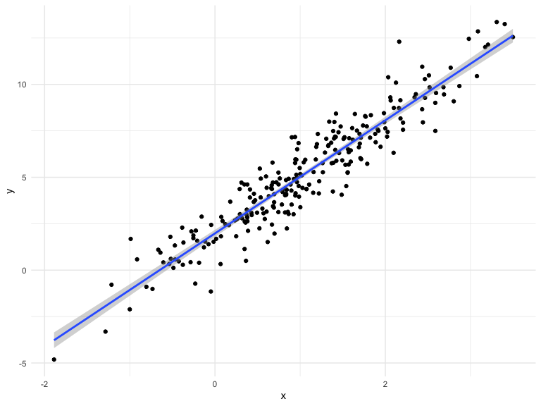

Bootstrapping
================
Yue Liu
2020-11-24

## Simulate data

``` r
n_samp = 250

sim_df_const = 
  tibble(
    x = rnorm(n_samp, 1, 1),
    error = rnorm(n_samp, 0, 1),
    y = 2 + 3 * x + error
  )

sim_df_nonconst = 
  sim_df_const %>% 
  mutate(
  error = error * .75 * x,
  y = 2 + 3 * x + error
)
```

Plot the dataset

``` r
sim_df_const %>% 
  ggplot(aes(x = x, y = y)) +
  geom_point() +
  geom_smooth(method = "lm")
```

    ## `geom_smooth()` using formula 'y ~ x'


