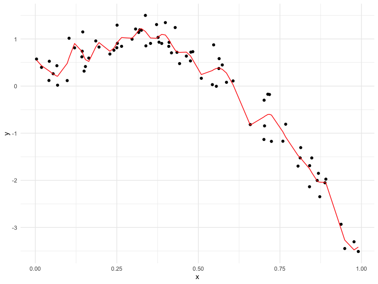
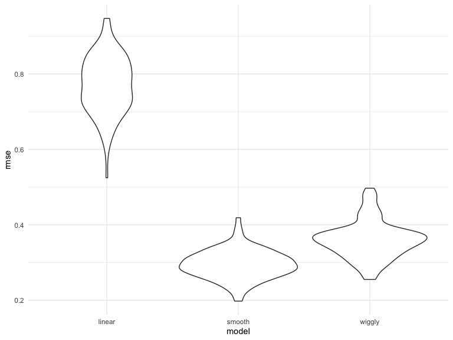
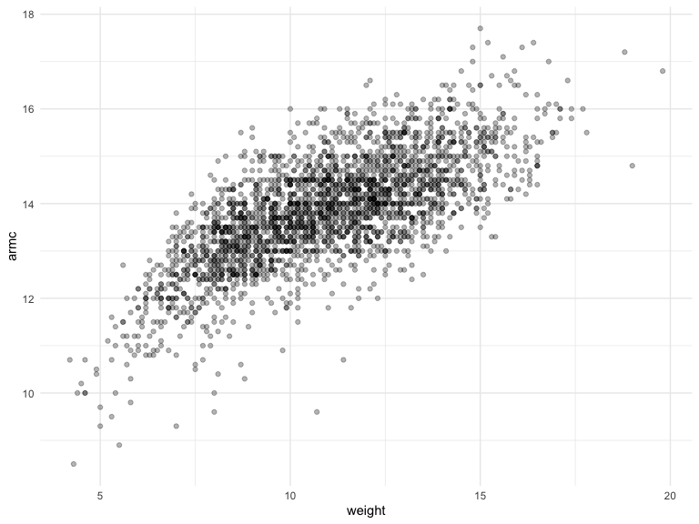
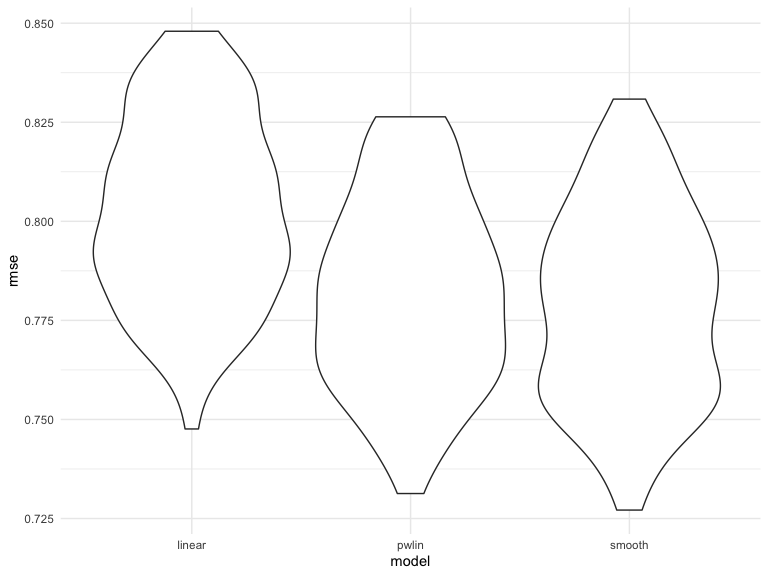

Cross Validation
================
Yue Liu
2020-11-24

when you have lots of possible variable, you have to choose which ones
will fo in your model.

For nested models, you have tests \[you have to be worried about
multiple comparisons and “fishing”\]

For non-nested models, you don’t have tests\[AIC/ BIC / etc are
traditional tools; Balance goodness of fit with “complexity”\]

randomly split data into “training” and “testing”

evaluate using root mean square error

Refinements and vatiations: Individual training/testing splits are
subjects to randomness; Repeat the process(illustrates variability in
prediction accuracy)

Cross validation is general

can use to compare candidate models that are all “traditional”

comes up a lot in “modern” methods (automed variable selection (lasso),
additive models, regression trees)

## Simulate data

``` r
nonlin_df = 
  tibble(
    id = 1:100,
    x = runif(100, 0, 1),
    y = 1 - 10 * (x - .3) ^ 2 + rnorm(100, 0, .3)
  )
```

Look at the data

``` r
nonlin_df %>% 
  ggplot(aes(x = x, y = y)) + 
  geom_point()
```


## Cross validation – by hand

get training and testing datasts

``` r
train_df = sample_n(nonlin_df, size = 80) #%>% arrange(id)
test_df = anti_join(nonlin_df, train_df, by = "id") #%>% arrange(id)
```

Fit three models

``` r
linear_mod = lm(y ~ x, data = train_df)
smooth_mod = gam(y ~ s(x), data = train_df)
wiggly_mod = gam(y ~ s(x, k = 30), sp = 10e-6, data = train_df)
```

``` r
train_df %>% 
  add_predictions(linear_mod) %>% #add a column of fitted values
  ggplot(aes(x = x, y = y)) + 
  geom_point() + 
  geom_line(aes(y = pred), color = "red")
```


``` r
train_df %>% 
  add_predictions(smooth_mod) %>% #add a column of fitted values
  ggplot(aes(x = x, y = y)) + 
  geom_point() + 
  geom_line(aes(y = pred), color = "red")
```


``` r
train_df %>% 
  add_predictions(wiggly_mod) %>% #add a column of fitted values
  ggplot(aes(x = x, y = y)) + 
  geom_point() + 
  geom_line(aes(y = pred), color = "red")
```



add prediction for multiple models

``` r
train_df %>% 
  gather_predictions(linear_mod, smooth_mod, wiggly_mod) %>% 
  ggplot(aes(x = x, y = y)) + 
  geom_point() + 
  geom_line(aes(y = pred), color = "red") +
  facet_grid(.~ model)
```


Look at prediction accuracy

``` r
rmse(linear_mod, test_df)
```

    ## [1] 0.8789948

``` r
rmse(smooth_mod, test_df)
```

    ## [1] 0.3238366

``` r
rmse(wiggly_mod, test_df)
```

    ## [1] 0.4122074

## Cross validation using `modelr`

``` r
cv_df = 
  crossv_mc(nonlin_df, 100)
```

What is happening here …

``` r
cv_df %>% 
  pull(train) %>% .[[1]] %>% as_tibble()
```

    ## # A tibble: 79 x 3
    ##       id      x      y
    ##    <int>  <dbl>  <dbl>
    ##  1     1 0.212   1.12 
    ##  2     2 0.899  -2.79 
    ##  3     5 0.241   0.761
    ##  4     6 0.442   0.477
    ##  5     7 0.104   1.02 
    ##  6     8 0.483   1.00 
    ##  7    10 0.185   0.958
    ##  8    11 0.116   0.746
    ##  9    12 0.0121  0.351
    ## 10    13 0.937  -2.93 
    ## # … with 69 more rows

``` r
cv_df = 
  cv_df %>% 
  mutate(
    train = map(train, as_tibble),
    test = map(test, as_tibble)
  )
```

Let’s try to fit models and get RMSEs for them

``` r
cv_df = 
  cv_df %>% 
  mutate(
    linear_mod = map(.x = train, ~lm(y ~ x, data = .x)),
    smooth_mod = map(.x = train, ~gam(y ~ s(x), data = .x)),
    wiggly_mod = map(.x = train, ~gam(y ~ s(x, k = 30), sp = 10e-6, data = .x))
  ) %>% 
  mutate(
    rmse_linear = map2_dbl(.x = linear_mod, .y = test, ~rmse(model = .x, data = .y)),
    rmse_smooth = map2_dbl(.x = smooth_mod, .y = test, ~rmse(model = .x, data = .y)),
    rmse_wiggly = map2_dbl(.x = wiggly_mod, .y = test, ~rmse(model = .x, data = .y))
  )
```

what do these results say about the model choices?

``` r
cv_df %>% 
  select(starts_with("rmse")) %>% 
  pivot_longer(
    everything(),
    names_to = "model",
    values_to = "rmse",
    names_prefix = "rmse_"
  ) %>% 
  ggplot(aes(x = model, y = rmse)) +
  geom_violin()
```



compute average

``` r
cv_df %>% 
  select(starts_with("rmse")) %>% 
  pivot_longer(
    everything(),
    names_to = "model",
    values_to = "rmse",
    names_prefix = "rmse_"
  ) %>% 
  group_by(model) %>% 
  summarize(avg_rmse = mean(rmse))
```

    ## `summarise()` ungrouping output (override with `.groups` argument)

    ## # A tibble: 3 x 2
    ##   model  avg_rmse
    ##   <chr>     <dbl>
    ## 1 linear    0.771
    ## 2 smooth    0.295
    ## 3 wiggly    0.360

## Try on a real dataset

``` r
child_growth_df = 
  read_csv("./data/nepalese_children.csv") %>% 
  mutate(
    weight_cp = (weight > 7) * (weight - 7) 
  )
```

    ## Parsed with column specification:
    ## cols(
    ##   age = col_double(),
    ##   sex = col_double(),
    ##   weight = col_double(),
    ##   height = col_double(),
    ##   armc = col_double()
    ## )

weight vs. arm circumference

``` r
child_growth_df %>% 
  ggplot(aes(x = weight, y = armc)) + 
  geom_point(alpha = 0.3)
```



Fit the model

``` r
linear_mod = lm(armc ~ weight, data = child_growth_df)
pwlin_mod = lm(armc ~ weight + weight_cp, data = child_growth_df)
smooth_mod  = gam(armc ~ s(weight), data = child_growth_df)
```

``` r
child_growth_df %>% 
  gather_predictions(linear_mod, pwlin_mod, smooth_mod) %>% 
  ggplot(aes(x = weight, y = armc)) + 
  geom_point(alpha = 0.3) +
  geom_line(aes(y = pred), color = "red") +
  facet_grid(. ~ model)
```


Try to understand model fit using cross validation

``` r
cv_df = 
  crossv_mc(child_growth_df, 100) %>% 
  mutate(
    train = map(train, as_tibble),
    test = map(test, as_tibble)
  )
```

``` r
cv_df = 
  cv_df %>% 
  mutate(
    linear_mod = map(.x = train, ~lm(armc ~ weight, data = .x)),
    pwlin_mod = map(.x = train, ~lm(armc ~ weight + weight_cp, data = .x)),
    smooth_mod = map(.x = train, ~gam(armc ~ s(weight), data = .x))
  ) %>% 
  mutate(
    rmse_linear = map2_dbl(.x = linear_mod, .y = test, ~rmse(model = .x, data = .y)),
    rmse_pwlin = map2_dbl(.x = pwlin_mod, .y = test, ~rmse(model = .x, data = .y)),
    rmse_smooth = map2_dbl(.x = smooth_mod, .y = test, ~rmse(model = .x, data = .y))
  )
```

Violin plot

``` r
cv_df %>% 
  select(starts_with("rmse")) %>% 
  pivot_longer(
    everything(),
    names_to = "model",
    values_to = "rmse",
    names_prefix = "rmse_"
  ) %>% 
  ggplot(aes(x = model, y = rmse)) +
  geom_violin()
```


