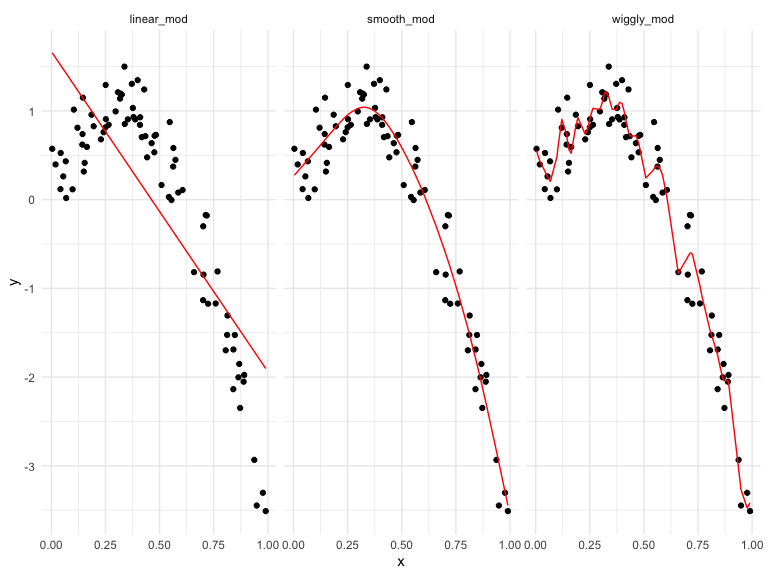

Cross Validation
================
Yue Liu
2020-11-24

when you have lots of possible variable, you have to choose which ones
will fo in your model.

For nested models, you have tests \[you have to be worried about
multiple comparisons and “fishing”\]

For non-nested models, you don’t have tests\[AIC/ BIC / etc are
traditional tools; Balance goodness of fit with “complexity”\]

randomly split data into “training” and “testing”

evaluate using root mean square error

Refinements and vatiations: Individual training/testing splits are
subjects to randomness; Repeat the process(illustrates variability in
prediction accuracy)

Cross validation is general

can use to compare candidate models that are all “traditional”

comes up a lot in “modern” methods (automed variable selection (lasso),
additive models, regression trees)

## Simulate data

``` r
nonlin_df = 
  tibble(
    id = 1:100,
    x = runif(100, 0, 1),
    y = 1 - 10 * (x - .3) ^ 2 + rnorm(100, 0, .3)
  )
```

Look at the data

``` r
nonlin_df %>% 
  ggplot(aes(x = x, y = y)) + 
  geom_point()
```


## Cross validation – by hand

get training and testing datasts

``` r
train_df = sample_n(nonlin_df, size = 80) #%>% arrange(id)
test_df = anti_join(nonlin_df, train_df, by = "id") #%>% arrange(id)
```

Fit three models

``` r
linear_mod = lm(y ~ x, data = train_df)
smooth_mod = gam(y ~ s(x), data = train_df)
wiggly_mod = gam(y ~ s(x, k = 30), sp = 10e-6, data = train_df)
```

``` r
train_df %>% 
  add_predictions(linear_mod) %>% #add a column of fitted values
  ggplot(aes(x = x, y = y)) + 
  geom_point() + 
  geom_line(aes(y = pred), color = "red")
```


``` r
train_df %>% 
  add_predictions(smooth_mod) %>% #add a column of fitted values
  ggplot(aes(x = x, y = y)) + 
  geom_point() + 
  geom_line(aes(y = pred), color = "red")
```


``` r
train_df %>% 
  add_predictions(wiggly_mod) %>% #add a column of fitted values
  ggplot(aes(x = x, y = y)) + 
  geom_point() + 
  geom_line(aes(y = pred), color = "red")
```


add prediction for multiple models

``` r
train_df %>% 
  gather_predictions(linear_mod, smooth_mod, wiggly_mod) %>% 
  ggplot(aes(x = x, y = y)) + 
  geom_point() + 
  geom_line(aes(y = pred), color = "red") +
  facet_grid(.~ model)
```



Look at prediction accuracy

``` r
rmse(linear_mod, test_df)
```

    ## [1] 0.7538765

``` r
rmse(smooth_mod, test_df)
```

    ## [1] 0.2374576

``` r
rmse(wiggly_mod, test_df)
```

    ## [1] 0.2538881
