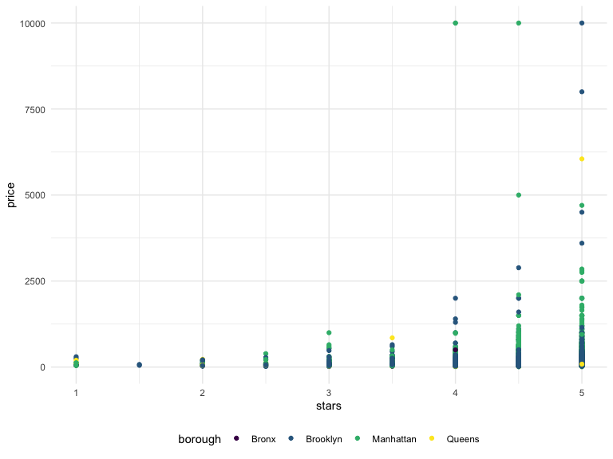
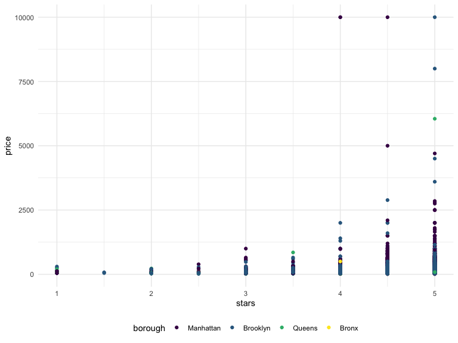

Linear Models
================
Yue Liu
2020-11-21

## Import the data

``` r
data("nyc_airbnb")

nyc_airbnb = 
  nyc_airbnb %>% 
  mutate(stars = review_scores_location / 2) %>% 
  rename(
    borough = neighbourhood_group
  ) %>% 
  filter(borough != "Staten Island") %>% 
  select(price, stars, borough, neighbourhood, room_type)
```

## Fit a model

``` r
nyc_airbnb %>% 
  ggplot(aes(x = stars, y = price, color = borough)) +
  geom_point()
```



``` r
fit = lm(price ~ stars + borough, data = nyc_airbnb)
```

Lets’s look at the results…

Let’s look at the results better…

``` r
broom::glance(fit)
```

    ## # A tibble: 1 x 12
    ##   r.squared adj.r.squared sigma statistic   p.value    df  logLik    AIC    BIC
    ##       <dbl>         <dbl> <dbl>     <dbl>     <dbl> <dbl>   <dbl>  <dbl>  <dbl>
    ## 1    0.0342        0.0341  182.      271. 6.73e-229     4 -2.02e5 4.04e5 4.04e5
    ## # … with 3 more variables: deviance <dbl>, df.residual <int>, nobs <int>

``` r
broom::tidy(fit) %>% 
# for a 1 unit increase in stars -> expect the price increase 32 dollars, keeping the borough fixed 
# reference group - Bronx
# Brooklyn 40.5 dollars more expensive than Bronx
  select(-std.error, -statistic) %>% 
  mutate(
    term = str_replace(term, "borough","Borough: " )
  ) %>% 
  knitr::kable(digits = 3)
```

| term               | estimate | p.value |
| :----------------- | -------: | ------: |
| (Intercept)        | \-70.414 |   0.000 |
| stars              |   31.990 |   0.000 |
| Borough: Brooklyn  |   40.500 |   0.000 |
| Borough: Manhattan |   90.254 |   0.000 |
| Borough: Queens    |   13.206 |   0.145 |

## Be in control of factors

factors are in alphabetic order -\> change the reference group…

``` r
nyc_airbnb = 
  nyc_airbnb %>% 
  mutate(
    borough = fct_infreq(borough), # in order of frequency of borough
    room_type = fct_infreq(borough)
  )
```

look at the plot again

``` r
nyc_airbnb %>% 
  ggplot(aes(x = stars, y = price, color = borough)) +
  geom_point()
```



``` r
fit = lm(price ~ stars + borough, data = nyc_airbnb)

broom::tidy(fit)
```

    ## # A tibble: 5 x 5
    ##   term            estimate std.error statistic   p.value
    ##   <chr>              <dbl>     <dbl>     <dbl>     <dbl>
    ## 1 (Intercept)         19.8     12.2       1.63 1.04e-  1
    ## 2 stars               32.0      2.53     12.7  1.27e- 36
    ## 3 boroughBrooklyn    -49.8      2.23    -22.3  6.32e-109
    ## 4 boroughQueens      -77.0      3.73    -20.7  2.58e- 94
    ## 5 boroughBronx       -90.3      8.57    -10.5  6.64e- 26
